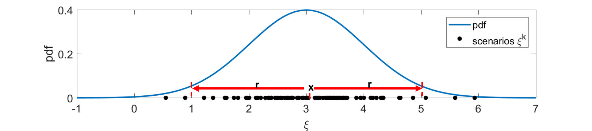

### The 1-D point covering problem

- Random samples of  are drawn from an underlying distribution .
- We would like to find the smallest segment  (centered at x with radius r) to cover  of .

- The optimization problem can be formulated as

Visually,

#### Feasible Region
The feasible region depends on the underlying distribution . We visualize the feasible for the following two cases

##### Gaussian Distribution 
Assume that  is drawn from a standard Gaussian distribution N(0,1). Then its feasible region can be visualized

Clearly, the optimal solution is x=0 and 

##### Discrete distribution

#### Different Approaches to Solve It

