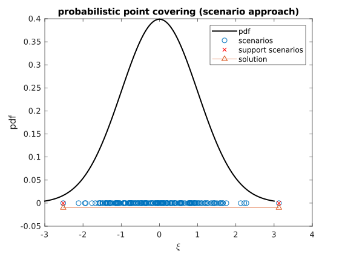

### An illustrative example: probabilistic point covering (PPC)

[Problem Description](./00-21-probabilistic-point-covering.md)

#### Solve PPC via the Scenario Approach

[code here](../examples/)

```Matlab
function ex_scenario_approach_ppc()
%EX_SCENARIO_APPROACH_PPC  solve the Probabilistic Point Covering via the scenario approach
% 
%   ConvertChanceConstraint (CCC)
%   Copyright (c) 2018-2019
%   by X.Geng
%   Last Edited: July.26.2019
%
%   This file is part of CCC.
%   Covered by the 3-clause BSD License (see LICENSE file for details).
%   See https://github.com/xb00dx/ConvertChanceConstraint-ccc for more info.

%% Probabilistic Point Covering (PPC)
% \min_{x,r} r 
%       s.t. P( x-r <= \xi <= x+r ) >= 1-epsilon
%            r >= 0
% \xi is from a standard Gaussian distribution N(0,1)
% this code plots the feasible region and optimal solution
dist = makedist('Normal','mu',0,'sigma',1);

%% Solve PPC via the Scenario Approach
% settings
epsilon = 5e-2; beta = 1e-3; d = 2;
ops.method = 'scenario approach';
ops.verbose = 0; % debug setting
% prepare data
N = calculate_sample_complexity(d, epsilon, beta, 'exact');
xi_scenarios = random(dist,[1,N]);
% formulate problem
sdpvar x r xi
obj = r;
det_constr = [r >= 0];
inner_constr = [x-r <= xi <= x+r];
chance_constr = prob(inner_constr, xi, epsilon, xi_scenarios, ops);
% solve PPC
diagnostics = optimize( [chance_constr;det_constr], obj);
disp(diagnostics.info);
assert(diagnostics.problem == 0);
disp( ['optimal x=',num2str(value(x))] );
disp( ['optimal r=',num2str(value(r))] );

%% Evaluate the solution
M = 1000;
testdata = random(dist,[1,M]);
% evaulate out-of-sample violation probability
epsilon_test = estimate_violation_probability(inner_constr, xi, testdata, ops);
disp(['empirical violation probability: ', num2str(epsilon_test)]);
% find support scenarios
ops.type = 'convex';
[sc, sc_indices] = find_support_scenarios(chance_constr, det_constr, obj, xi_scenarios, ops);
disp([num2str(length(sc_indices)),' support scenarios found: scenario no.', mat2str(sc_indices)]);
disp(['scenarios: ', mat2str(sc)]);


%% Visualization
% problem description
xi_axis = -3:0.01:3;
pdf = normpdf(xi_axis,0,1);
ppc_scenario = figure;
plot(xi_axis,pdf,'k-','LineWidth',1.5), hold on,
plot(xi_scenarios, zeros(size(xi_scenarios)),'o'), hold on,
plot(sc, zeros(size(sc)),'rx'), hold on,
plot( [value(x)-value(r), value(x)+value(r)], [-0.01, -0.01], '^-'), hold on,
xlabel('\xi'), ylabel('pdf')
legend('pdf','scenarios','support scenarios','solution')
title('probabilistic point covering (scenario approach)')
print(ppc_scenario,'-depsc','-painters','ex_scenario_approach_ppc.eps')
print(ppc_scenario,'-dsvg','ex_scenario_approach_ppc.svg')

% actual feasible region

% approx feasible region via the scenario approach

end
```

#### Results Analysis

